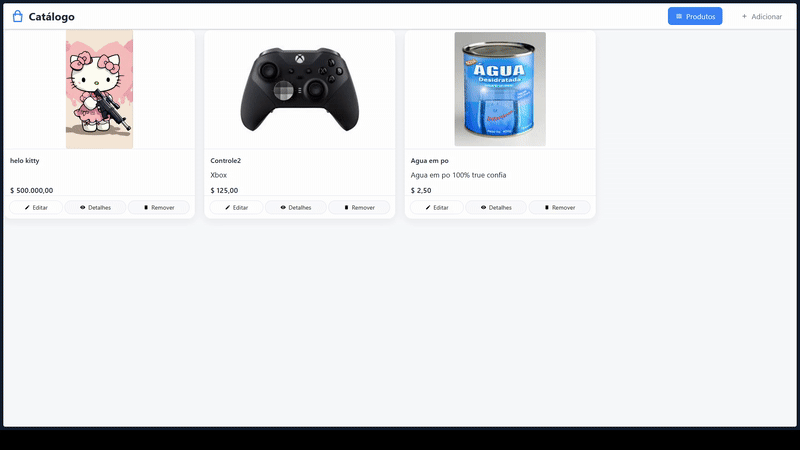

# 📦 Catálogo de Produtos

## 📋 Informações do Projeto

**Universidade:** Universidade Federal do Tocantins
**Curso:** Ciência da Computação
**Disciplina:** Engenharia de Software - ES  
**Semestre:** 2025/2
**Professor:** Edeilson Milhomem da Silva

## 👥 Equipe

- Cayke Daniel P. Veras
- Gabryel Dellanne Santiago Araujo
- Lucas Yudi Modesto
- Lucas Gabriel Costa Farias
- Filipe Silva Coelho

## 📝 Descrição do Projeto

O **Catálogo de Produtos** é uma aplicação web desenvolvida em PHP que permite o gerenciamento completo de um catálogo de produtos. O sistema oferece uma interface intuitiva para cadastrar, visualizar, editar e gerenciar produtos com suas respectivas informações e imagens.

## 🎯 Objetivo

Desenvolver uma aplicação web robusta e funcional que demonstre o conhecimento em desenvolvimento backend com PHP, utilizando padrões de arquitetura MVC (Model-View-Controller), gerenciamento de banco de dados MySQL e implementação de funcionalidades CRUD completas.

## ✨ Funcionalidades Implementadas

### 🔧 Funcionalidades Principais
- ✅ **Cadastro de Produtos**: Formulário completo para adicionar novos produtos
- ✅ **Listagem de Produtos**: Visualização em cards responsivos de todos os produtos
- ✅ **Edição de Produtos**: Modificação de informações de produtos existentes
- ✅ **Exclusão de Produtos**: Remoção segura de produtos com limpeza de arquivos
- ✅ **Upload de Imagens**: Sistema de upload com validação de tipo e tamanho
- ✅ **Validação de Dados**: Validação robusta de formulários no frontend e backend
- ✅ **Interface Responsiva**: Design moderno e adaptável a diferentes dispositivos
- ✅ **Preview de Imagens**: Visualização prévia das imagens antes do upload

### 🛠️ Funcionalidades Técnicas
- ✅ **Arquitetura MVC**: Separação clara entre Model, View e Controller
- ✅ **Sistema de Rotas**: Roteamento customizado com parâmetros dinâmicos
- ✅ **Conexão com Banco de Dados**: Integração com MySQL usando PDO
- ✅ **Gerenciamento de Ambiente**: Sistema de variáveis de ambiente (.env)
- ✅ **Autoload de Classes**: Carregamento automático de classes PHP
- ✅ **Tratamento de Erros**: Sistema robusto de tratamento de exceções
- ✅ **Validação de Upload**: Controle de tipo, tamanho e segurança de arquivos
- ✅ **Prepared Statements**: Proteção contra SQL Injection
- ✅ **Sanitização de Dados**: Limpeza e validação de entrada do usuário
- ✅ **Gerenciamento de Sessões**: Sistema de mensagens de feedback

### 📊 Estrutura de Dados
- **Produtos**: ID, Título, Preço, Descrição, URL da Imagem, Data de Criação

## 🏗️ Arquitetura do Sistema

```
catalogo-es/
├── app/
│   ├── controllers/          # Controladores (lógica de negócio)
│   │   ├── ProductController.php
│   │   └── NotFoundController.php
│   ├── models/              # Modelos (acesso a dados)
│   │   ├── Database.php
│   │   ├── ProductModel.php
│   │   └── UserModel.php
│   ├── views/               # Views (interface do usuário)
│   │   ├── add-product.php
│   │   ├── edit-product.php
│   │   ├── home.php
│   │   └── partials/
│   ├── public/              # Recursos públicos
│   │   ├── css/            # Estilos CSS
│   │   ├── js/             # Scripts JavaScript
│   │   └── uploads/        # Imagens enviadas
│   ├── router/             # Sistema de rotas
│   │   └── routes.php
│   ├── utils/              # Utilitários
│   │   ├── LoadEnv.php
│   │   └── RenderView.php
│   └── core/               # Núcleo da aplicação
│       └── Core.php
└── index.php               # Ponto de entrada
```

## 🚀 Tecnologias Utilizadas

- **Backend**: PHP 7.4+
- **Banco de Dados**: MySQL
- **Frontend**: HTML5, CSS3, JavaScript (Vanilla)
- **Padrões**: MVC, PSR-4 (Autoload)
- **Ferramentas**: PDO, Composer (para autoload)

## 📋 Pré-requisitos

### Sistema
- PHP 7.4 ou superior
- MySQL 5.7 ou superior
- Servidor web (Apache/Nginx) ou PHP Built-in Server

### Extensões PHP Necessárias
- `PDO` - Para conexão com banco de dados
- `PDO_MySQL` - Driver MySQL para PDO
- `GD` - Para manipulação de imagens
- `fileinfo` - Para validação de tipos de arquivo
- `mbstring` - Para manipulação de strings multibyte

### Verificar Extensões
```bash
php -m | grep -E "(pdo|mysql|gd|fileinfo|mbstring)"
```

## ⚙️ Configuração e Instalação

### 1. Clone o Repositório
```bash
git clone [URL_DO_REPOSITORIO]
cd catalogo-es
```

### 2. Configuração do Banco de Dados

Crie um banco de dados MySQL e execute o seguinte script SQL:

```sql
CREATE DATABASE catalogo_produtos;

USE catalogo_produtos;

CREATE TABLE Products (
    id INT AUTO_INCREMENT PRIMARY KEY,
    title VARCHAR(255) NOT NULL,
    price DECIMAL(10,2) NOT NULL,
    description TEXT,
    image_url VARCHAR(500),
    created_at TIMESTAMP DEFAULT CURRENT_TIMESTAMP
);
```

### 3. Configuração das Variáveis de Ambiente

Crie um arquivo `.env` na raiz do projeto com as seguintes configurações:

```env
# Configurações do Banco de Dados
DB_HOST=localhost
DB_PORT=3306
DB_NAME=catalogo_produtos
DB_USER=seu_usuario
DB_PASSWORD=sua_senha

# Configurações da Aplicação
APP_ENV=development
APP_DEBUG=true
```

### 4. Configuração do Servidor Web

#### Opção A: PHP Built-in Server (Desenvolvimento)
```bash
php -S localhost:8000
```

#### Opção B: Apache/Nginx
Configure o DocumentRoot para apontar para a pasta do projeto e certifique-se de que o mod_rewrite está habilitado.

### 5. Permissões de Diretório
```bash
# Linux/Mac
chmod 755 app/public/uploads/
chown www-data:www-data app/public/uploads/

# Windows
# Certifique-se de que o usuário do servidor web tem permissão de escrita na pasta uploads
```

### 6. Acesse a Aplicação
Abra seu navegador e acesse:
- **Desenvolvimento**: `http://localhost:8000`
- **Produção**: `http://seu-dominio.com`

## 📱 Como Usar

### Cadastrar Produto
1. Acesse a página inicial
2. Clique em "Adicionar Produto"
3. Preencha os campos obrigatórios (Nome e Preço)
4. Adicione uma descrição (opcional)
5. Faça upload de uma imagem (opcional)
6. Clique em "Cadastrar Produto"

### Editar Produto
1. Na listagem de produtos, clique no botão "Editar"
2. Modifique as informações desejadas
3. Clique em "Atualizar Produto"

### Excluir Produto
1. Na listagem de produtos, clique no botão "Remover"
2. Confirme a exclusão
3. O produto e sua imagem serão removidos permanentemente

### Visualizar Produtos
- Todos os produtos são exibidos na página inicial em formato de cards
- Cada card mostra: imagem, nome, descrição e preço
- Interface responsiva que se adapta a diferentes tamanhos de tela

## 🔧 Rotas da Aplicação

| Rota | Método | Descrição |
|------|--------|-----------|
| `/` | GET | Lista todos os produtos |
| `/add-product` | GET/POST | Formulário de cadastro e processamento |
| `/edit-product/{id}` | GET | Formulário de edição |
| `/update-product/{id}` | POST | Processamento da atualização |
| `/delete-product/{id}` | DELETE | Deleção de produtos

## 🎥 Vídeo de Apresentação



> **Demonstração do Sistema**: O GIF acima mostra o funcionamento completo do sistema de catálogo de produtos, incluindo cadastro, listagem e edição de produtos.

## 🔧 Troubleshooting

### Problemas Comuns

**Erro de conexão com banco de dados:**
- Verifique se o MySQL está rodando
- Confirme as credenciais no arquivo `.env`
- Teste a conexão manualmente

**Erro de upload de imagens:**
- Verifique as permissões da pasta `app/public/uploads/`
- Confirme se a extensão `fileinfo` está habilitada
- Verifique o limite de upload no PHP (`upload_max_filesize`)

**Página 404:**
- Verifique se o mod_rewrite está habilitado (Apache)
- Confirme se o DocumentRoot está correto
- Teste com o PHP Built-in Server

## 📄 Licença

Este projeto foi desenvolvido para fins acadêmicos e educacionais como parte da disciplina de Engenharia de Software da Universidade Federal do Tocantins.

## 🤝 Contribuição

Este é um projeto acadêmico desenvolvido pela equipe de Ciência da Computação da UFT. Para sugestões ou melhorias, entre em contato com a equipe de desenvolvimento.